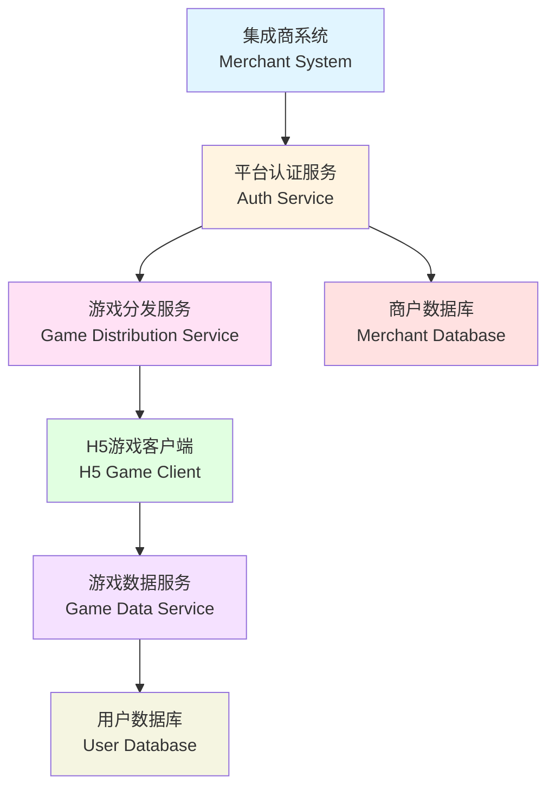
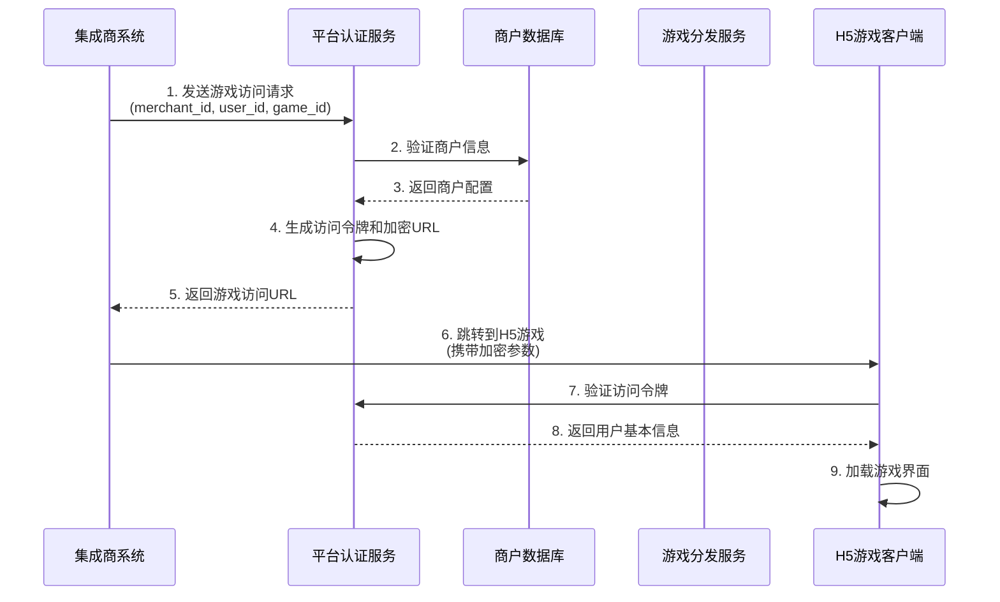
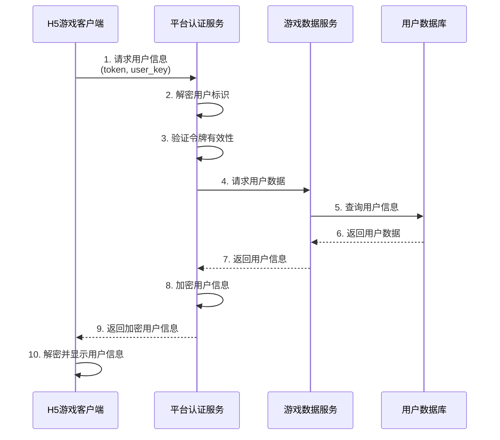
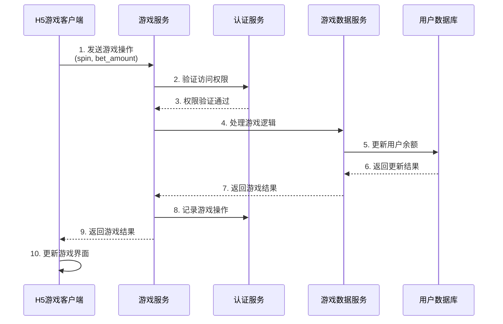
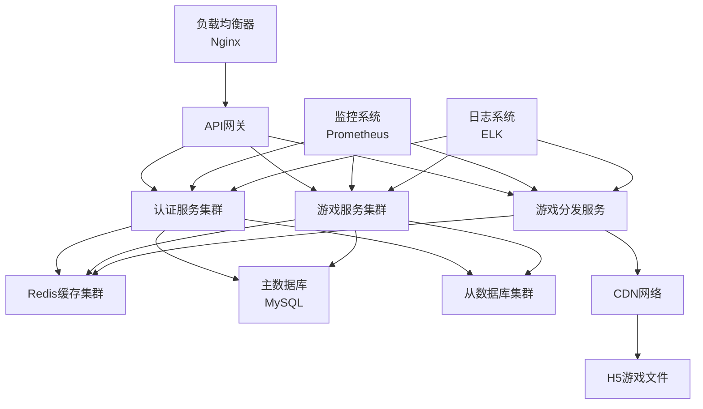

# 游戏访问机制设计文档

## 📋 文档概述

本文档描述了一个安全的游戏访问机制，采用类似 OAuth 2.0 的授权流程，确保集成商安全地访问平台上的 H5 游戏。

### 🎯 设计目标

- **安全性**: 确保游戏访问权限严格控制，防止未授权访问
- **可扩展性**: 支持多个集成商和多种游戏类型
- **用户体验**: 用户无需在游戏端重新登录
- **数据保护**: 保护用户敏感信息，如余额等

### 🔄 设计原则

1. **最小权限原则**: 集成商只能获得必要的访问权限
2. **时间有效性**: 访问令牌具有有效期限
3. **加密传输**: 所有敏感数据都经过加密处理
4. **审计追踪**: 记录所有访问和操作日志

## 🏗️ 系统架构

### 系统组件



### 组件职责

| 组件 | 职责 |
|------|------|
| **集成商系统** | 发起游戏访问请求，处理用户登录 |
| **平台认证服务** | 处理认证、生成加密游戏URL、令牌管理 |
| **游戏分发服务** | 分发H5游戏，处理游戏加载 |
| **H5游戏客户端** | 游戏界面和逻辑，获取用户信息 |
| **游戏数据服务** | 提供游戏数据，处理游戏操作 |
| **用户数据库** | 存储用户基本信息和游戏数据 |
| **商户数据库** | 存储集成商信息和配置 |

## 🔐 安全机制

### 加密算法选择

| 数据类型 | 加密算法 | 密钥长度 | 说明 |
|----------|----------|----------|------|
| 游戏URL参数 | AES-256-CBC | 256位 | 对称加密 |
| 签名验证 | HMAC-SHA256 | 256位 | 消息认证 |
| 令牌生成 | JWT (RS256) | 2048位 | 非对称加密 |

### 安全策略

1. **URL参数加密**: 使用AES-256-CBC加密游戏URL中的敏感参数
2. **时间戳验证**: 防止重放攻击，URL在5分钟内有效
3. **签名验证**: 所有请求都包含HMAC-SHA256签名
4. **IP白名单**: 限制游戏访问来源IP
5. **速率限制**: 防止暴力攻击，每分钟最多100次请求

## 📡 API接口设计

### 1. 游戏访问授权接口

#### 接口描述
集成商向平台服务端请求游戏访问权限

#### 请求参数
```typescript
interface AuthRequest {
    merchant_id: string;        // 商户ID
    user_id: string;           // 用户ID
    game_id: string;           // 游戏ID
    timestamp: number;         // 当前时间戳
    nonce: string;             // 随机字符串
    signature: string;         // 请求签名
    language?: string;         // 语言偏好
    currency?: string;         // 货币类型
}
```

#### 响应参数
```typescript
interface AuthResponse {
    success: boolean;
    game_url: string;          // 加密的游戏URL
    token: string;             // 访问令牌
    expires_in: number;        // 令牌过期时间(秒)
    timestamp: number;         // 响应时间戳
}
```

### 2. 用户信息获取接口

#### 接口描述
H5游戏根据加密参数获取用户信息

#### 请求参数
```typescript
interface UserInfoRequest {
    token: string;             // 访问令牌
    user_key: string;          // 加密的用户标识
    timestamp: number;         // 时间戳
    signature: string;         // 请求签名
}
```

#### 响应参数
```typescript
interface UserInfoResponse {
    success: boolean;
    user_info: {
        user_id: string;       // 用户ID
        username: string;      // 用户名
        avatar_url: string;    // 头像URL
        balance: number;       // 余额
        currency: string;      // 货币类型
        vip_level: number;     // VIP等级
    };
    timestamp: number;
}
```

### 3. 游戏操作接口

#### 接口描述
处理游戏内的各种操作（下注、结算等）

#### 请求参数
```typescript
interface GameActionRequest {
    token: string;             // 访问令牌
    action: string;            // 操作类型 (spin, bet, win)
    game_data: any;            // 游戏数据
    timestamp: number;
    signature: string;
}
```

#### 响应参数
```typescript
interface GameActionResponse {
    success: boolean;
    action_result: any;        // 操作结果
    balance: number;           // 更新后的余额
    timestamp: number;
}
```

## 🔄 业务流程

### 1. 游戏访问授权流程



### 2. 用户信息获取流程



### 3. 游戏操作流程



## 🔗 游戏URL结构

### 加密URL格式

```
https://games.platform.com/slot-game?
  token=eyJhbGciOiJIUzI1NiIsInR5cCI6IkpXVCJ9...
  &data=k4w8n0m1a2b3c4d5e6f7g8h9i0j1k2l3m4n5o6p7q8r9s0t1u2v3w4x5y6z
  &timestamp=1699123456789
  &signature=1a2b3c4d5e6f7g8h9i0j1k2l3m4n5o6p7q8r9s0t1u2v3w4x5y6z
```

### 参数说明

| 参数 | 类型 | 说明 | 示例 |
|------|------|------|------|
| token | string | JWT访问令牌 | `eyJhbGci...` |
| data | string | AES加密的游戏数据 | `k4w8n...` |
| timestamp | number | 时间戳 | `1699123456789` |
| signature | string | HMAC-SHA256签名 | `1a2b3c...` |

### 加密数据格式 (加密前)

```json
{
  "merchant_id": "merchant_001",
  "user_id": "user_12345",
  "game_id": "slot_game_v1",
  "language": "zh-CN",
  "currency": "CNY",
  "return_url": "https://merchant.com/game-callback",
  "expires_at": 1699123756789
}
```

## 📊 数据格式定义

### 1. 商户信息

```typescript
interface Merchant {
    merchant_id: string;
    merchant_name: string;
    api_key: string;
    api_secret: string;
    allowed_games: string[];
    ip_whitelist: string[];
    is_active: boolean;
    created_at: number;
    updated_at: number;
}
```

### 2. 游戏配置

```typescript
interface GameConfig {
    game_id: string;
    game_name: string;
    game_type: string;
    game_url: string;
    min_bet: number;
    max_bet: number;
    rtp: number;
    is_active: boolean;
    supported_languages: string[];
    supported_currencies: string[];
}
```

### 3. 访问令牌

```typescript
interface AccessToken {
    header: {
        alg: string;        // 算法: RS256
        typ: string;        // 类型: JWT
    };
    payload: {
        iss: string;        // 签发者: platform
        sub: string;        // 主题: user_id
        aud: string;        // 受众: game_id
        exp: number;        // 过期时间
        iat: number;        // 签发时间
        merchant_id: string;
        permissions: string[];
    };
    signature: string;
}
```

## ⚡ 性能和可靠性

### 性能指标

| 指标 | 目标值 | 备注 |
|------|--------|------|
| 认证响应时间 | < 100ms | 不包括网络延迟 |
| 用户信息获取 | < 200ms | 从数据库查询 |
| 游戏操作处理 | < 50ms | 不包括数据库操作 |
| 令牌验证 | < 10ms | 本地验证 |
| URL生成 | < 20ms | 加密处理 |

### 可靠性设计

1. **缓存策略**
   - 商户信息缓存 (1小时)
   - 游戏配置缓存 (30分钟)
   - 用户基本信息缓存 (5分钟)

2. **降级策略**
   - 认证服务失败时使用缓存令牌
   - 数据库不可用时使用Redis缓存
   - 游戏服务失败时返回本地模式

3. **监控告警**
   - 实时监控访问成功率
   - 异常请求告警
   - 性能指标告警

## 🔒 安全风险和防范措施

### 常见安全风险

| 风险类型 | 描述 | 防范措施 |
|----------|------|----------|
| **重放攻击** | 攻击者重复使用有效请求 | 时间戳验证 + 5分钟有效期 |
| **中间人攻击** | 拦截和修改通信数据 | HTTPS加密传输 |
| **令牌泄露** | 访问令牌被盗用 | 短期有效期 + 可撤销 |
| **暴力破解** | 尝试大量可能的密钥 | 速率限制 + IP封禁 |
| **跨站脚本** | 恶意脚本注入 | CSP + 输入验证 |

### 安全审计

1. **访问日志**
   - 记录所有API访问
   - 包含时间戳、IP、操作类型
   - 异常行为自动告警

2. **操作审计**
   - 记录敏感操作
   - 变更追踪和回滚
   - 定期安全审计

## 📈 扩展性设计

### 水平扩展

1. **服务拆分**
   - 认证服务独立部署
   - 游戏服务独立扩展
   - 数据读写分离

2. **负载均衡**
   - API网关负载均衡
   - 数据库读写分离
   - 缓存集群

### 功能扩展

1. **多游戏支持**
   - 统一的游戏接口
   - 灵活的游戏配置
   - 插件化游戏加载

2. **多商户支持**
   - 商户隔离
   - 差异化配置
   - 独立计费

## 🚀 部署建议

### 生产环境部署



### 环境配置

| 环境 | 用途 | 数据库 | 缓存 |
|------|------|--------|------|
| **开发环境** | 开发和测试 | 单机MySQL | 单机Redis |
| **测试环境** | 集成测试 | 主从MySQL | Redis Sentinel |
| **生产环境** | 正式运行 | MySQL集群 | Redis Cluster |

## 📝 测试策略

### 测试类型

1. **功能测试**
   - 认证流程测试
   - 游戏访问测试
   - 用户信息获取测试
   - 游戏操作测试

2. **安全测试**
   - 加密算法测试
   - 令牌验证测试
   - 签名验证测试
   - 异常请求测试

3. **性能测试**
   - 并发访问测试
   - 压力测试
   - 稳定性测试
   - 容量规划

### 测试工具

- **Postman**: API接口测试
- **JMeter**: 性能测试
- **OWASP ZAP**: 安全测试
- **Selenium**: 集成测试

## 🎯 实施计划

### 第一阶段 (核心功能)

- [ ] 认证服务开发
- [ ] 游戏分发服务开发
- [ ] 加密解密模块开发
- [ ] 基础API接口实现

### 第二阶段 (游戏集成)

- [ ] H5游戏客户端集成
- [ ] 用户信息获取接口
- [ ] 游戏操作接口
- [ ] 错误处理和日志记录

### 第三阶段 (优化和完善)

- [ ] 性能优化
- [ ] 安全加固
- [ ] 监控告警系统
- [ ] 文档完善

### 第四阶段 (部署和上线)

- [ ] 环境搭建
- [ ] 灰度发布
- [ ] 监控部署
- [ ] 正式上线

## 📞 技术支持

### 开发团队
- **架构师**: 负责整体架构设计
- **后端开发**: 认证和游戏服务开发
- **前端开发**: H5游戏客户端开发
- **运维工程师**: 部署和运维支持

### 联系方式
- **技术邮箱**: tech-support@platform.com
- **紧急联系**: +86-400-XXX-XXXX
- **工作群**: 企业微信群

---

**文档版本**: v1.0  
**创建时间**: 2024-01-15  
**最后更新**: 2024-01-15  
**作者**: 平台技术团队