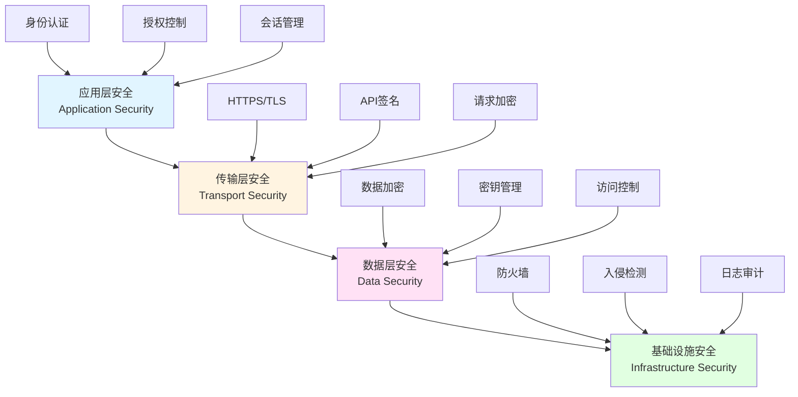
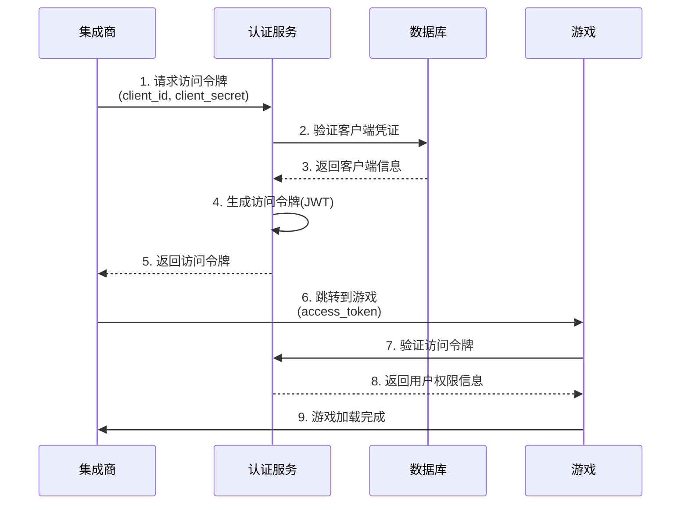
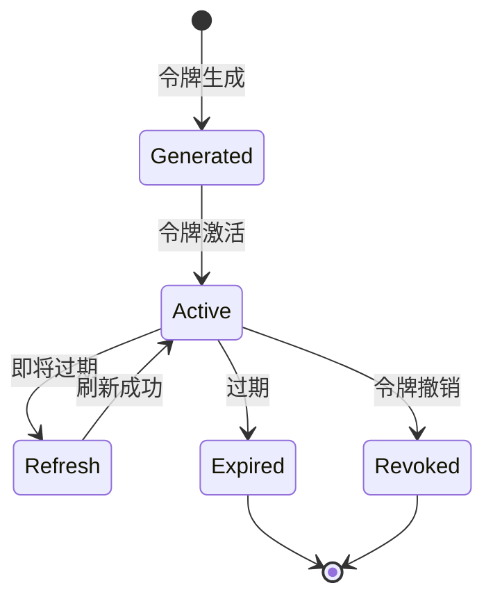
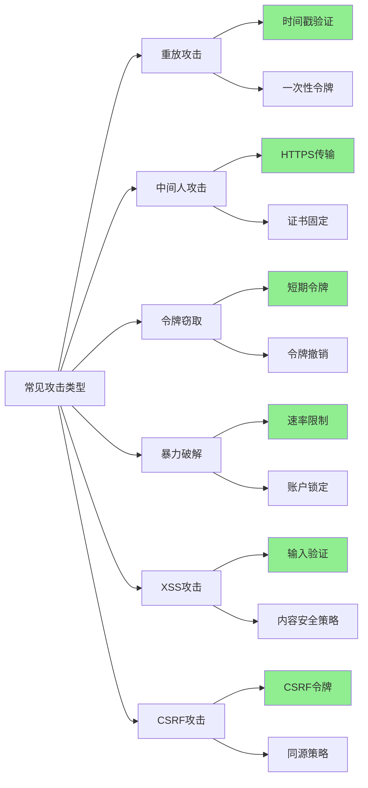
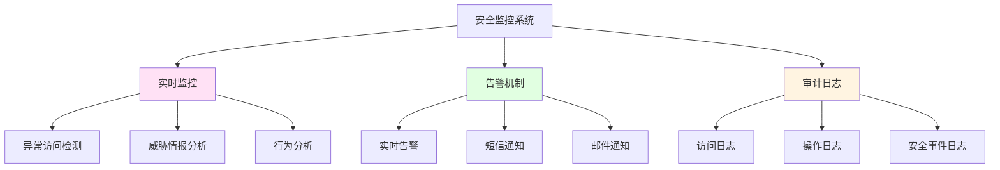
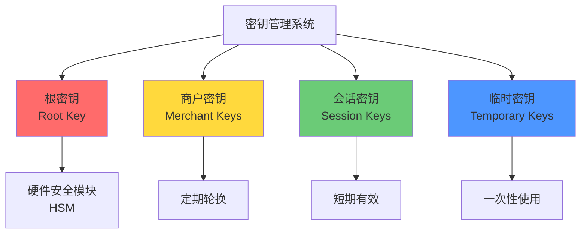
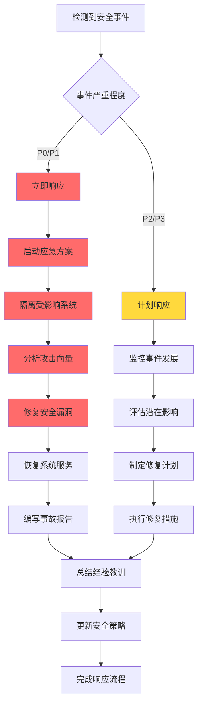

# 游戏访问机制安全设计文档

## 🔒 安全架构概述

### 安全分层架构



### 安全目标

| 安全目标 | 具体措施 | 优先级 |
|----------|----------|--------|
| **机密性** | 数据加密传输和存储 | 高 |
| **完整性** | 签名验证和数据校验 | 高 |
| **可用性** | 负载均衡和容灾备份 | 高 |
| **可控性** | 访问控制和权限管理 | 中 |
| **不可抵赖性** | 操作日志和审计追踪 | 中 |

## 🛡️ 认证和授权机制

### OAuth 2.0 风格的认证流程



### JWT 令牌结构

#### Header (头部)

```json
{
  "alg": "RS256",
  "typ": "JWT",
  "kid": "key_2024_01"
}
```

#### Payload (载荷)

```json
{
  "iss": "platform.com",
  "sub": "user_platform_12345",
  "aud": "slot_game_v1",
  "exp": 1699127056789,
  "iat": 1699123456789,
  "jti": "token_1699123456789_unique",
  "merchant_id": "merchant_001",
  "permissions": [
    "game:play",
    "game:bet",
    "game:collect"
  ],
  "user_info": {
    "user_id": "user_platform_12345",
    "user_type": "registered"
  }
}
```

#### Signature (签名)

```
HMACSHA256(
  base64UrlEncode(header) + "." + base64UrlEncode(payload),
  secret
)
```

### 令牌生命周期管理



## 🔐 加密算法选择和实现

### 加密算法对比

| 算法 | 用途 | 密钥长度 | 性能 | 安全级别 |
|------|------|----------|------|----------|
| **AES-256-GCM** | 数据加密 | 256位 | 高 | 高 |
| **RSA-2048** | 密钥交换 | 2048位 | 中 | 高 |
| **HMAC-SHA256** | 消息认证 | 256位 | 高 | 中 |
| **PBKDF2** | 密钥派生 | 256位 | 中 | 高 |

### 具体实现

#### 1. URL参数加密 (AES-256-CBC)

```typescript
import crypto from 'crypto';

class URLEncryptor {
  private algorithm = 'aes-256-cbc';
  private key: Buffer;
  private iv: Buffer;

  constructor(secretKey: string) {
    this.key = crypto.createHash('sha256').update(secretKey).digest();
    this.iv = crypto.randomBytes(16);
  }

  encrypt(data: string): string {
    const cipher = crypto.createCipheriv(this.algorithm, this.key, this.iv);
    let encrypted = cipher.update(data, 'utf8', 'hex');
    encrypted += cipher.final('hex');
    return this.iv.toString('hex') + ':' + encrypted;
  }

  decrypt(encryptedData: string): string {
    const parts = encryptedData.split(':');
    const iv = Buffer.from(parts[0], 'hex');
    const encrypted = parts[1];
    const decipher = crypto.createDecipheriv(this.algorithm, this.key, iv);
    let decrypted = decipher.update(encrypted, 'hex', 'utf8');
    decrypted += decipher.final('utf8');
    return decrypted;
  }
}
```

#### 2. 请求签名 (HMAC-SHA256)

```typescript
class RequestSigner {
  private secret: string;

  constructor(secret: string) {
    this.secret = secret;
  }

  sign(params: Record<string, any>, timestamp: number, nonce: string): string {
    // 按字母顺序排序参数
    const sortedKeys = Object.keys(params).sort();
    const paramString = sortedKeys.map(key => {
      return `${key}=${params[key]}`;
    }).join('&');

    const signString = `${paramString}&timestamp=${timestamp}&nonce=${nonce}`;

    return crypto
      .createHmac('sha256', this.secret)
      .update(signString)
      .digest('hex');
  }

  verify(params: Record<string, any>, timestamp: number, nonce: string, signature: string): boolean {
    const calculatedSignature = this.sign(params, timestamp, nonce);
    return calculatedSignature === signature;
  }
}
```

#### 3. JWT 令牌生成和验证

```typescript
import jwt from 'jsonwebtoken';

class TokenManager {
  private privateKey: string;
  private publicKey: string;
  private algorithm = 'RS256';

  constructor(privateKey: string, publicKey: string) {
    this.privateKey = privateKey;
    this.publicKey = publicKey;
  }

  generateToken(payload: any, expiresIn: number = 1800): string {
    return jwt.sign(payload, this.privateKey, {
      algorithm: this.algorithm,
      expiresIn: expiresIn
    });
  }

  verifyToken(token: string): any {
    try {
      return jwt.verify(token, this.publicKey, {
        algorithms: [this.algorithm]
      });
    } catch (error) {
      throw new Error('Invalid token');
    }
  }

  decodeToken(token: string): any {
    return jwt.decode(token);
  }
}
```

## 🚫 安全威胁和防护措施

### 常见攻击类型防护



### 具体防护措施

#### 1. 重放攻击防护

```typescript
class ReplayAttackProtector {
  private requestCache: Map<string, number> = new Map();
  private readonly ttl = 300000; // 5分钟

  isReplayRequest(requestId: string): boolean {
    const currentTime = Date.now();
    const cachedTime = this.requestCache.get(requestId);

    if (cachedTime && currentTime - cachedTime < this.ttl) {
      return true; // 重放攻击
    }

    this.requestCache.set(requestId, currentTime);
    this.cleanExpiredRequests(currentTime);
    return false;
  }

  private cleanExpiredRequests(currentTime: number): void {
    for (const [key, time] of this.requestCache.entries()) {
      if (currentTime - time > this.ttl) {
        this.requestCache.delete(key);
      }
    }
  }
}
```

#### 2. 速率限制

```typescript
class RateLimiter {
  private requestCounts: Map<string, number[]> = new Map();
  private readonly maxRequests = 100;
  private readonly windowMs = 60000; // 1分钟

  isAllowed(identifier: string): boolean {
    const currentTime = Date.now();
    let requests = this.requestCounts.get(identifier) || [];

    // 清理过期的请求记录
    requests = requests.filter(time => currentTime - time < this.windowMs);

    if (requests.length >= this.maxRequests) {
      return false; // 超过限制
    }

    requests.push(currentTime);
    this.requestCounts.set(identifier, requests);
    return true;
  }
}
```

#### 3. 输入验证

```typescript
class InputValidator {
  static validateUserId(userId: string): boolean {
    const userIdRegex = /^[a-zA-Z0-9_]{4,32}$/;
    return userIdRegex.test(userId);
  }

  static validateMerchantId(merchantId: string): boolean {
    const merchantIdRegex = /^merchant_[a-zA-Z0-9]{3,28}$/;
    return merchantIdRegex.test(merchantId);
  }

  static validateBetAmount(amount: number): boolean {
    return amount >= 0.1 && amount <= 1000 && amount % 0.1 === 0;
  }

  static sanitizeInput(input: string): string {
    return input.replace(/[<>\"'&]/g, '');
  }
}
```

## 🔍 安全监控和审计

### 安全监控指标



### 安全事件分类

| 级别 | 事件类型 | 响应时间 | 处理方式 |
|------|----------|----------|----------|
| **P0** | 系统入侵、数据泄露 | 5分钟 | 立即响应，启动应急方案 |
| **P1** | 大量异常访问、API滥用 | 15分钟 | 临时封禁，调查原因 |
| **P2** | 单个异常请求、参数错误 | 1小时 | 记录日志，监控趋势 |
| **P3** | 正常业务异常、系统错误 | 4小时 | 分析原因，优化流程 |

### 审计日志格式

```typescript
interface AuditLog {
  log_id: string;             // 日志ID
  timestamp: number;          // 时间戳
  user_id: string;            // 用户ID
  merchant_id: string;        // 商户ID
  action: string;             // 操作类型
  resource: string;           // 资源标识
  ip_address: string;         // IP地址
  user_agent: string;         // 用户代理
  request_data: any;          // 请求数据
  response_code: number;      // 响应状态码
  execution_time: number;     // 执行时间(ms)
  risk_level: 'low' | 'medium' | 'high'; // 风险级别
  additional_info: any;       // 附加信息
}
```

## 🔧 密钥管理

### 密钥分层架构



### 密钥管理策略

#### 1. 密钥生成

```typescript
class KeyGenerator {
  static generateApiKey(): string {
    const bytes = crypto.randomBytes(32);
    return 'api_' + bytes.toString('hex').substring(0, 32);
  }

  static generateApiSecret(): string {
    const bytes = crypto.randomBytes(64);
    return bytes.toString('hex');
  }

  static generateAESKey(): Buffer {
    return crypto.randomBytes(32);
  }

  static generateRSAKeyPair(): { publicKey: string; privateKey: string } {
    const { publicKey, privateKey } = crypto.generateKeyPairSync('rsa', {
      modulusLength: 2048,
      publicKeyEncoding: {
        type: 'spki',
        format: 'pem'
      },
      privateKeyEncoding: {
        type: 'pkcs8',
        format: 'pem'
      }
    });
    return { publicKey, privateKey };
  }
}
```

#### 2. 密钥存储

```typescript
class KeyStorage {
  private keyVault: Map<string, KeyInfo> = new Map();

  storeKey(keyId: string, keyData: string, metadata: KeyMetadata): void {
    // 加密存储
    const encryptedKey = this.encryptForStorage(keyData);
    
    this.keyVault.set(keyId, {
      keyId,
      encryptedKey,
      metadata,
      createdAt: Date.now(),
      lastAccessedAt: Date.now()
    });
  }

  retrieveKey(keyId: string): string | null {
    const keyInfo = this.keyVault.get(keyId);
    if (!keyInfo) return null;

    // 更新访问时间
    keyInfo.lastAccessedAt = Date.now();
    
    return this.decryptFromStorage(keyInfo.encryptedKey);
  }
}
```

#### 3. 密钥轮换

```typescript
class KeyRotator {
  private rotationInterval = 30 * 24 * 60 * 60 * 1000; // 30天

  checkAndRotateKeys(): void {
    const keys = this.getAllKeys();
    
    for (const key of keys) {
      if (this.shouldRotate(key)) {
        this.rotateKey(key.keyId);
      }
    }
  }

  private shouldRotate(key: KeyInfo): boolean {
    const keyAge = Date.now() - key.createdAt;
    return keyAge > this.rotationInterval;
  }

  private rotateKey(keyId: string): void {
    const newKey = KeyGenerator.generateApiSecret();
    const oldKey = this.retrieveKey(keyId);
    
    // 存储新密钥
    this.storeKey(keyId, newKey, {});
    
    // 通知相关系统
    this.notifyKeyChange(keyId, oldKey);
  }
}
```

## 🌐 网络安全配置

### HTTPS/TLS 配置

```nginx
# Nginx TLS配置示例
server {
    listen 443 ssl http2;
    server_name api.platform.com;

    # SSL证书
    ssl_certificate /etc/nginx/ssl/cert.pem;
    ssl_certificate_key /etc/nginx/ssl/key.pem;

    # SSL协议和加密套件
    ssl_protocols TLSv1.2 TLSv1.3;
    ssl_ciphers 'ECDHE-ECDSA-AES256-GCM-SHA384:ECDHE-RSA-AES256-GCM-SHA384';
    ssl_prefer_server_ciphers on;

    # HSTS
    add_header Strict-Transport-Security "max-age=31536000; includeSubDomains" always;

    # 其他安全头
    add_header X-Frame-Options "SAMEORIGIN" always;
    add_header X-Content-Type-Options "nosniff" always;
    add_header X-XSS-Protection "1; mode=block" always;
    add_header Content-Security-Policy "default-src 'self'" always;
}
```

### 防火墙规则

```bash
# UFW 防火墙规则示例

# 默认拒绝所有入站连接
ufw default deny incoming

# 允许SSH
ufw allow 22/tcp

# 允许HTTP/HTTPS
ufw allow 80/tcp
ufw allow 443/tcp

# 允许特定IP访问管理接口
ufw allow from 203.0.113.0/24 to any port 8080

# 拒绝已知恶意IP
ufw deny from 192.0.2.0/24

# 启用防火墙
ufw enable
```

## 🧪 安全测试

### 安全测试类型

| 测试类型 | 工具 | 频率 | 负责人 |
|----------|------|------|--------|
| **渗透测试** | OWASP ZAP, Burp Suite | 季度 | 安全团队 |
| **漏洞扫描** | Nessus, OpenVAS | 月度 | 安全团队 |
| **代码审计** | SonarQube, Semgrep | 持续 | 开发团队 |
| **依赖检查** | npm audit, Snyk | 每次构建 | 开发团队 |
| **配置审计** | Lynis, Benchmarks | 月度 | 运维团队 |

### 安全测试清单

- [ ] SQL注入测试
- [ ] XSS攻击测试
- [ ] CSRF攻击测试
- [ ] XXE攻击测试
- [ ] 文件包含测试
- [ ] 命令注入测试
- [ ] SSRF攻击测试
- [ ] 权限绕过测试
- [ ] 会话劫持测试
- [ ] API速率限制测试

## 🚨 应急响应流程

### 安全事件响应流程



### 应急响应团队

| 角色 | 职责 | 联系方式 |
|------|------|----------|
| **安全负责人** | 总指挥，决策协调 | security-lead@platform.com |
| **安全工程师** | 技术分析，漏洞修复 | security-eng@platform.com |
| **运维工程师** | 系统隔离，服务恢复 | ops@platform.com |
| **开发工程师** | 代码修复，功能验证 | dev@platform.com |
| **公关负责人** | 对外沟通，声誉管理 | pr@platform.com |

## 📊 安全指标和KPI

### 关键安全指标

| 指标 | 目标值 | 监控频率 |
|------|--------|----------|
| **安全事件响应时间** | < 15分钟 | 实时 |
| **漏洞修复时间** | < 24小时 | 每日 |
| **API滥用率** | < 0.1% | 每日 |
| **认证失败率** | < 1% | 每小时 |
| **数据泄露事件** | 0 | 实时 |
| **安全培训覆盖率** | 100% | 季度 |

### 安全评分体系

```typescript
interface SecurityScore {
  infrastructure: number;    // 基础设施安全 (0-100)
  application: number;       // 应用安全 (0-100)
  network: number;          // 网络安全 (0-100)
  data: number;             // 数据安全 (0-100)
  compliance: number;       // 合规性 (0-100)
  
  overallScore: number;     // 综合评分 (0-100)
  riskLevel: 'low' | 'medium' | 'high' | 'critical';
}
```

## 📞 安全联系方式

- **安全邮箱**: security@platform.com
- **紧急响应**: +86-400-SEC-URE-1
- **漏洞报告**: https://security.platform.com/report
- **安全团队**: 企业微信群

---

**文档版本**: v1.0  
**创建时间**: 2024-01-15  
**最后更新**: 2024-01-15  
**维护团队**: 平台安全团队